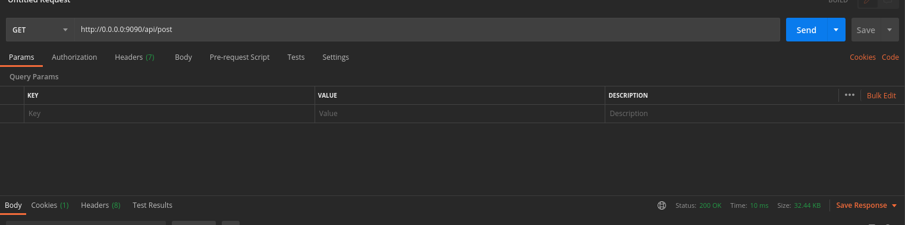

## About PHP MVC Skeleton

This is a web application framework with PHP MVC Skeleton base on PHP language
Developed based on Ubuntu operating system

## About version
 *  Php >= 5.6
 *  Mysql >= 5.7
 *  Nodejs >= 16.x

## Docker
Before initializing Docker, please delete/chmod 777 the ```./mysql``` folder
- ```npm run docker_5.6```
- ```npm run docker_7.0```
- ```npm run docker_7.3```
- ```npm run docker_7.4```
- ```npm run docker_8.0```
- ```npm run docker_8.1```
- ```npm run docker_8.2```
- ```npm run docker_8.3```

## Database
 - Edit ```./render_table_file.json```
 - For create structure table ```npm run table```
 - For import structure table ```docker exec -i ${DOCKER_PREFIX}mysql mysql -uroot -p${MYSQL_PASSWORD} ${MYSQL_DATABASE} < render_table_file.sql```
 - For import data example(posts) ```npm run news```

## Style/css/script/images
 - Style ./v/default/[package]/assets/
 - Image ./v/default/[package]/assets/images
 - Script ./v/default/[package]/assets/
 - For frontend ```npm run build```
 - For backend ```npm run build-backend```

 ## Languages
 - Edit ./v/default/languages/languages.csv
 - Key is column 1
 - English is column 2
 - Vietnamese is column 3
 - For build ```npm run languages```

 ## Setup step by step 
 - Go to root directory ```/path_to/mvc```
 - Make .env file ```cp ./.env.example ./.env```
 - Make network docker ```docker network create php_dev_network```
 - Make docker ```npm run docker_5.6 1```
 - Make data example: 
    - Go to docker php ```docker exec -it mvc-docker-php /bin/sh -c "[ -e /bin/bash ] && /bin/bash || /bin/sh"``` 
    - And then run script create database example ```npm run news```
 - Make assets file ```npm run build``` and ```npm run build-backend```
 - Try ```http://0.0.0.0:9090```

## Keep it simple and faster ;)


[Postman](./PHP-MVC-Skeleton.postman_collection.json)

## Author
*  Lê Duy Khoa
*  Mail: web.fast.2017@gmail.com
*  Skype: leduykhoa060690
*  Mobile: +84973421508
*  Telegram: https://t.me/leduykhoa
*  Website: https://web-fast.com
